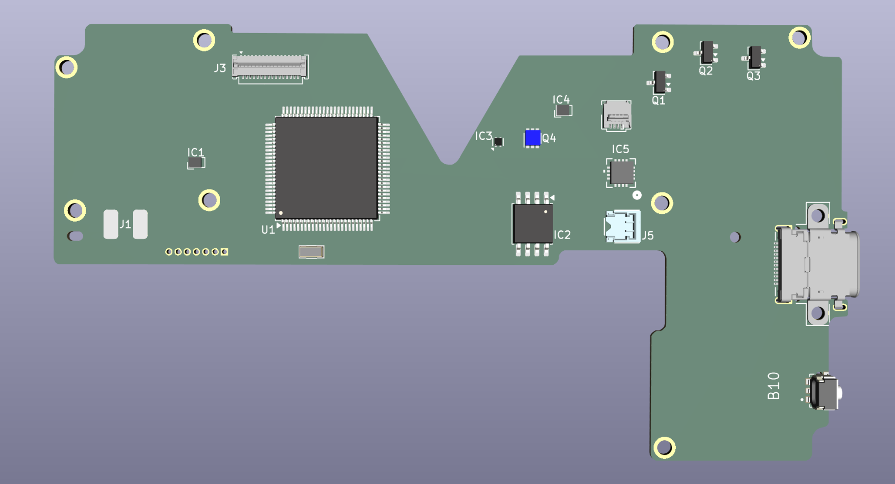

# Zelda Game & Watch (2021) Reproduction Board



An open-source hardware attempt to reproduce and clone the PCB layout of the Zelda version of the Nintendo Game & Watch (2021). 

The goal of this project is to create a drop-in hardware reproduction that honors the mechanical constraints, component alignment, and routing logic of the original handheld, utilizing modern EDA workflows.

For now I'm trying to imitate the board as-is and will eventually move towards modifying it and the BOM to make it easier/at all possible to source the necessary components.

## Project Structure

This project is self-contained and structured for **KiCad 10.0+**. All non-standard footprints, 3D models, and schematic symbols are bundled locally to ensure environment portability.

```text
.
├── fp-lib-table
├── sym-lib-table
├── libs/
│   ├── gnw.kicad_sym
│   ├── gnw.pretty/
│   └── gnw.3dshapes/
├── subsheets/
│   ├── audio.kicad_sch
│   ├── buttons.kicad_sch
│   ├── lcd.kicad_sch
│   ├── mcu.kicad_sch
│   ├── power.kicad_sch
│   └── spi_flash.kicad_sch
├── zelda-gnw-repro.kicad_pcb
├── zelda-gnw-repro.kicad_sch
└── zelda-gnw-repro.kicad_pro
